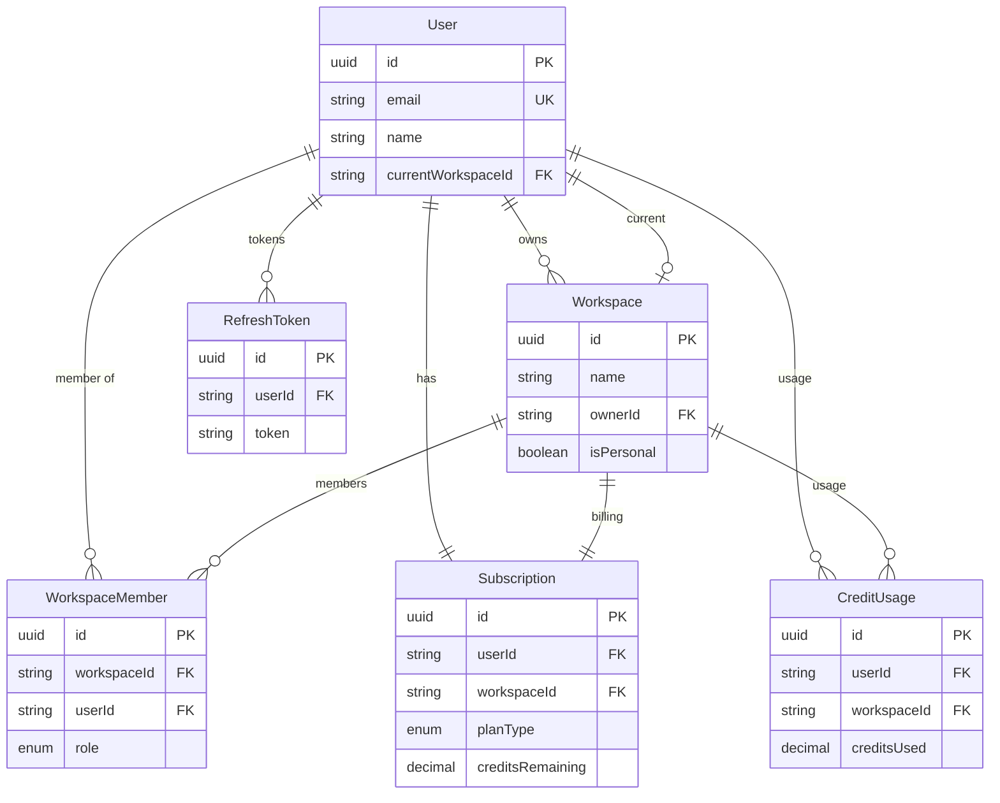
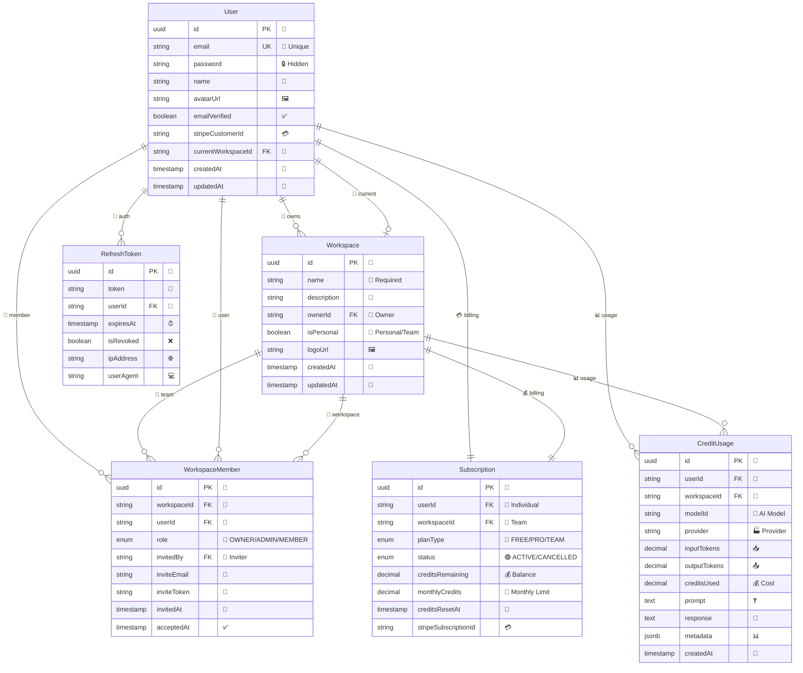

# DataKit Backend Database Relationships Chart

## Visual Entity Relationship Diagram

https://mermaid.live

## 🔍 Simplified Overview Diagram



## 📊 Detailed Entity Relationship Diagram



## 📋 Quick Reference Table

```
┌─────────────────┬──────────────────┬─────────────────────────────────────┐
│     ENTITY      │   RELATIONSHIPS  │           KEY FIELDS                │
├─────────────────┼──────────────────┼─────────────────────────────────────┤
│ User            │ → owns Workspace │ email (unique), currentWorkspaceId  │
│                 │ → has Subscription│ stripeCustomerId, emailVerified    │
│                 │ → member of Teams│                                     │
├─────────────────┼──────────────────┼─────────────────────────────────────┤
│ Workspace       │ ← owned by User  │ name, ownerId, isPersonal          │
│                 │ → has Members    │                                     │
│                 │ → has Subscription│                                     │
├─────────────────┼──────────────────┼─────────────────────────────────────┤
│ WorkspaceMember │ ← belongs to User│ workspaceId, userId, role          │
│                 │ ← belongs to Work│ invitedBy, inviteToken             │
├─────────────────┼──────────────────┼─────────────────────────────────────┤
│ Subscription    │ ← belongs to User│ planType, status, creditsRemaining │
│                 │ ← belongs to Work│ stripeSubscriptionId, monthlyCredits│
├─────────────────┼──────────────────┼─────────────────────────────────────┤
│ CreditUsage     │ ← belongs to User│ modelId, provider, creditsUsed     │
│                 │ ← belongs to Work│ inputTokens, outputTokens          │
├─────────────────┼──────────────────┼─────────────────────────────────────┤
│ RefreshToken    │ ← belongs to User│ token, expiresAt, isRevoked        │
│                 │                  │ ipAddress, userAgent               │
└─────────────────┴──────────────────┴─────────────────────────────────────┘
```

## 🔄 Relationship Flow

```
User
├── 👑 owns → Workspace(s)
├── 🏢 works in → currentWorkspace
├── 👥 member of → WorkspaceMember(s) → Workspace(s)
├── 💳 has → Subscription
├── 📊 generates → CreditUsage(s)
└── 🎫 authenticates via → RefreshToken(s)

Workspace
├── 👑 owned by ← User (owner)
├── 👥 contains → WorkspaceMember(s) → User(s)
├── 💰 billed via → Subscription
└── 📊 tracks → CreditUsage(s)
```

## Database Schema Overview

### Core Entities Summary

| Entity | Purpose | Key Features |
|--------|---------|--------------|
| **User** | User authentication & profile | Email-based auth, Stripe integration, workspace membership |
| **Workspace** | Multi-tenant organization | Personal/shared workspaces, ownership model |
| **WorkspaceMember** | Team collaboration | Role-based access, invitation system |
| **Subscription** | Billing & credits | Flexible user/workspace billing, credit limits |
| **CreditUsage** | AI usage tracking | Token counting, cost tracking, audit trail |
| **RefreshToken** | Secure authentication | JWT refresh tokens, device tracking |

### Relationship Patterns

#### 1. **User-Centric Relationships**
- Users can own multiple workspaces
- Users belong to multiple workspaces via WorkspaceMember
- Users have one current active workspace
- Users have individual subscriptions and credit usage tracking

#### 2. **Workspace Multi-tenancy**
- Workspaces can be personal (single user) or shared (team)
- Each workspace has one owner but multiple members
- Subscriptions can be tied to either users or workspaces
- Credit usage is tracked per workspace context

#### 3. **Flexible Billing Model**
- Subscriptions support both individual and team billing
- Credits can be user-specific or workspace-specific
- Stripe integration for payment processing
- Monthly credit reset automation

#### 4. **Security & Audit**
- Refresh tokens track device sessions
- Credit usage provides complete audit trail
- Invitation system for secure team joining
- Role-based workspace access control

### Database Configuration

- **Database**: PostgreSQL
- **ORM**: TypeORM with decorators
- **Migration**: Automated schema versioning
- **Constraints**: Unique constraints on email, workspace membership
- **Indexes**: Performance optimization on userId, workspaceId
- **Data Types**: UUID primary keys, decimal precision for financial data

### Business Logic Highlights

1. **Multi-tenant Architecture**: Supports both personal and enterprise use cases
2. **Credit System**: Precise tracking of AI model usage and costs
3. **Team Collaboration**: Role-based workspace access with invitation flow
4. **Flexible Subscriptions**: Can bill individuals or entire workspaces
5. **Security**: Comprehensive authentication with refresh token management
6. **Audit Trail**: Complete usage history for billing and compliance

---

*Generated from TypeORM entity analysis - DataKit v0 Backend Schema*