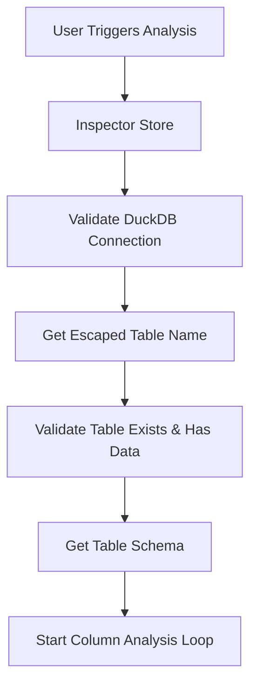
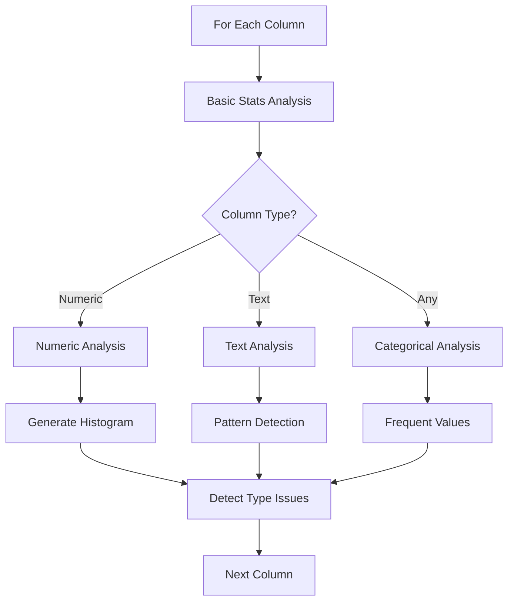
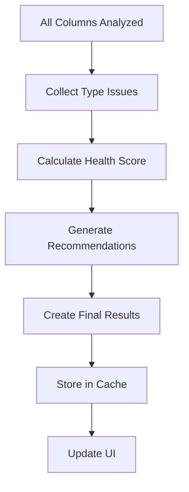
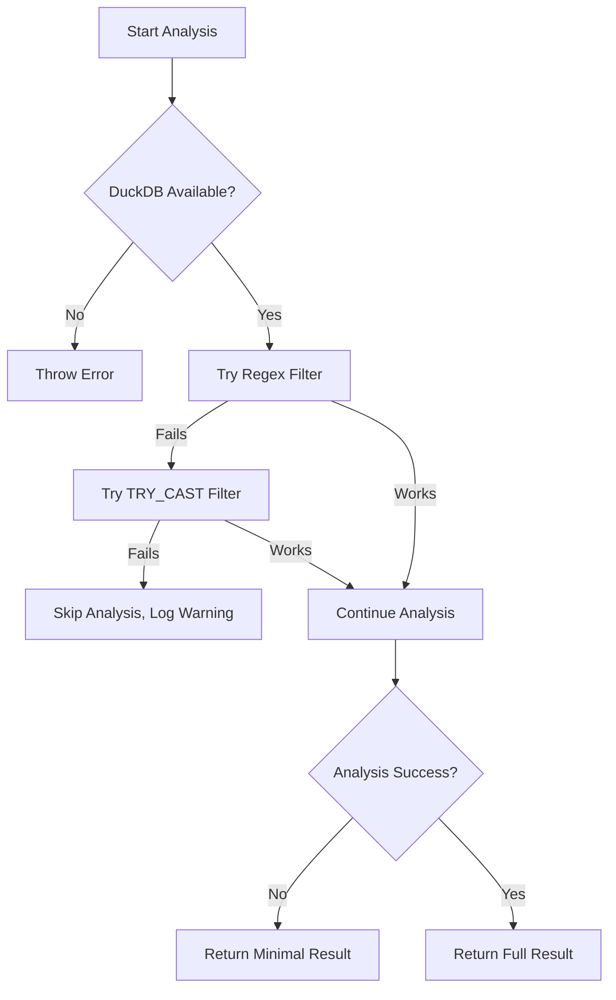
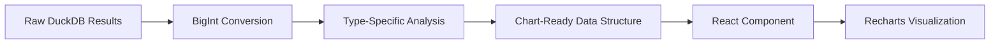

# Inspector Flow and Architecture Guide

A comprehensive guide to understanding the data quality inspector's architecture, data flow, and utility functions.

## 📁 File Structure Overview

```
lib/duckdb/inspector/
├── index.ts                 # 🚪 Main entry point and orchestration
├── types.ts                 # 📋 All TypeScript interfaces and types
├── utils/                   # 🔧 Core utilities (the foundation)
│   ├── bigint.ts           # 💾 DuckDB BigInt ↔ JavaScript conversion
│   ├── filtering.ts        # 🔍 SQL WHERE clause generation
│   └── validation.ts       # ✅ Column type detection and validation
└── analysis/               # 📊 Analysis modules (the specialists)
    ├── basic.ts            # 📈 Fundamental column statistics
    ├── numeric.ts          # 🔢 Numeric data analysis and histograms
    ├── text.ts             # 📝 Text pattern and quality analysis
    ├── categorical.ts      # 🏷️ Frequency and distribution analysis
    └── quality.ts          # 🎯 Overall data quality assessment
```

## 🌊 Data Flow: From Raw Data to Insights

### Phase 1: Initialization and Validation


### Phase 2: Column-by-Column Analysis


### Phase 3: Quality Assessment and Results


## 🔧 Why We Need These Utils: The Foundation Layer

### 1. **bigint.ts** - The Data Conversion Specialist

**Why it exists:** DuckDB returns large numbers as JavaScript BigInt, but our UI and charts need regular numbers.

```typescript
// ❌ Without this utility:
const count = result.count; // BigInt(1500000n)
JSON.stringify(count); // Error! BigInt can't be serialized

// ✅ With our utility:
const count = safeToNumber(result.count); // 1500000 (regular number)
JSON.stringify(count); // "1500000" ✅
```

**What it prevents:**
- JSON serialization errors
- Chart rendering failures  
- Memory overflow from massive numbers
- Type mismatches in calculations

**Key functions:**
- `processDuckDBResult()` - Converts entire result arrays
- `safeToNumber()` - Safely converts single values with fallbacks
- `convertBigIntValue()` - Handles edge cases like infinity

### 2. **filtering.ts** - The SQL Safety Guard

**Why it exists:** Raw SQL queries are dangerous and DuckDB has specific syntax requirements.

```typescript
// ❌ Dangerous and error-prone:
const query = `SELECT * FROM table WHERE ${columnName} > 0`; // SQL injection risk!

// ✅ Safe and robust:
const whereClause = getNumericFilterClause(columnName);
const query = `SELECT * FROM table WHERE ${whereClause}`;
```

**What it prevents:**
- SQL injection attacks
- Column name conflicts (spaces, special chars)
- DuckDB-specific syntax errors
- Type conversion issues in WHERE clauses

**Key functions:**
- `escapeColumnName()` - Safely quotes column names
- `getNumericFilterClause()` - Filters valid numeric data with regex
- `getNumericFilterClauseFallback()` - Backup method using TRY_CAST
- `combineFilterClauses()` - Safely joins multiple conditions

**The "NaN Problem" Solution:**
```sql
-- ❌ This caused your original error:
WHERE "column" IS NOT 'NaN'  -- DuckDB tries to convert 'NaN' to column type

-- ✅ Our solution:
WHERE REGEXP_MATCHES("column"::VARCHAR, '^-?[0-9]*\.?[0-9]+([eE][-+]?[0-9]+)?$')
```

### 3. **validation.ts** - The Type Detective

**Why it exists:** Different column types need completely different analysis approaches.

```typescript
// ❌ Without validation - everything gets treated the same:
columns.forEach(col => generateHistogram(col)); // Fails on text columns!

// ✅ With validation - smart routing:
if (isNumericColumn(col.type)) {
  generateHistogram(col);
} else if (isTextColumn(col.type)) {
  analyzeTextPatterns(col);
}
```

**What it enables:**
- **Smart Analysis Routing**: Numbers get histograms, text gets pattern analysis
- **Performance Optimization**: Skip expensive analysis on unsuitable columns
- **Error Prevention**: Don't try to calculate mean of text data
- **User Experience**: Show relevant insights for each data type

**Key functions:**
- `isNumericColumn()` - Detects numeric types across different SQL dialects
- `categorizeColumnType()` - Groups types into analysis categories
- `isSuitableForHistogram()` - Prevents histograms on inappropriate data
- `getOptimalBinCount()` - Calculates ideal histogram bins

## 📊 Analysis Modules: The Specialists

### **basic.ts** - The Foundation Inspector
```typescript
// What it provides:
{
  nullCount: 150,          // Missing values
  nullPercentage: 15.0,    // 15% missing
  uniqueCount: 850,        // Distinct values  
  cardinality: 0.85        // Uniqueness ratio
}
```

**Why separate:** Every column needs these basics, regardless of type.

### **numeric.ts** - The Math Wizard
```typescript
// What it provides:
{
  min: 0, max: 100, mean: 47.5,
  q1: 25, q3: 75,          // Quartiles for outlier detection
  outliers: 23,            // Values outside 1.5*IQR
  histogramData: [...]     // Ready-to-chart bins
}
```

**Why separate:** Complex statistical calculations, histogram generation, outlier detection.

### **text.ts** - The Pattern Detective  
```typescript
// What it provides:
{
  avgLength: 12.5,         // Average string length
  patterns: {
    emailLike: 45,         // Email-pattern matches
    urlLike: 12,           // URL-pattern matches
    allCaps: 156           // ALL CAPS text
  }
}
```

**Why separate:** Text analysis is completely different from numbers - regex patterns, NLP concepts.

### **categorical.ts** - The Distribution Analyst
```typescript
// What it provides:
{
  frequentValues: [
    { value: "Red", count: 500, percentage: 50 },
    { value: "Blue", count: 300, percentage: 30 }
  ],
  entropy: 1.8,            // Distribution randomness
  isUniform: false         // Evenly distributed?
}
```

**Why separate:** Category analysis needs special algorithms (entropy, Gini coefficient).

### **quality.ts** - The Health Doctor
```typescript
// What it provides:
{
  healthScore: 85,         // Overall 0-100 score
  typeIssues: [...],       // Data type problems
  recommendations: [       // Actionable advice
    "🔴 Fix critical type issues in: price, date",
    "📊 Consider handling missing data in: description"
  ]
}
```

**Why separate:** Quality assessment requires domain knowledge about data problems.

## 🎯 The Orchestration Layer: index.ts

**Why we need it:** Coordinates all the specialists into a complete analysis.

```typescript
// The conductor function:
export async function analyzeColumn(connection, table, column, type, totalRows) {
  // 1. Always get basics
  const basic = await getBasicColumnStats(connection, table, column, type);
  
  // 2. Route based on type  
  if (isNumericColumn(type)) {
    const numeric = await getNumericStats(connection, table, column);
    if (isSuitableForHistogram(type, basic.uniqueCount, totalRows)) {
      const histogram = await generateNumericHistogram(connection, table, column);
    }
  }
  
  // 3. Universal analysis
  const typeIssues = await detectTypeIssues(connection, table, column, type);
  
  return { basic, numeric, histogram, typeIssues };
}
```

## 🔄 Error Recovery Flow



**Why this matters:** The browser environment is unpredictable. Network issues, memory limits, and DuckDB compatibility vary across browsers.

## 🎨 Chart Data Pipeline



**Example transformation:**
```typescript
// Raw DuckDB result:
{ bin_num: BigInt(1n), count: BigInt(150n), bin_start: 0.0, bin_end: 10.0 }

// After our pipeline:
{ bin: "B1", count: 150, range: "0.0-10.0", binStart: 0, binEnd: 10 }

// Perfect for Recharts BarChart!
```

## 🚀 Performance Optimizations

### **Parallel Processing**
```typescript
// All column analyses run simultaneously:
const analyses = await Promise.all(
  columns.map(col => analyzeColumn(connection, table, col.name, col.type, totalRows))
);
```

### **Smart Skipping**
```typescript
// Don't analyze inappropriate combinations:
if (!isSuitableForHistogram(columnType, uniqueCount, totalRows)) {
  return; // Skip expensive histogram generation
}
```

### **Progress Tracking**
```typescript
// Real-time updates:
set({
  analysisProgress: (currentColumn / totalColumns) * 100,
  analysisStatus: `Analyzing column: ${columnName} (${currentColumn}/${totalColumns})`
});
```

## 🧪 Testing Strategy

Each module is designed for isolated testing:

```typescript
// Test utilities independently:
describe('BigInt Utils', () => {
  test('converts BigInt safely', () => {
    expect(safeToNumber(BigInt(150))).toBe(150);
  });
});

// Test analysis modules with mocked connections:
describe('Numeric Analysis', () => {
  test('generates histogram', async () => {
    const mockConnection = createMockConnection();
    const bins = await generateNumericHistogram(mockConnection, 'table', 'column');
    expect(bins).toHaveLength(8);
  });
});
```

## 🎯 Key Design Principles

1. **Single Responsibility**: Each file has one clear job
2. **Error Isolation**: Failures in one analysis don't break others  
3. **Type Safety**: Full TypeScript coverage with proper interfaces
4. **Performance First**: Parallel processing, smart skipping, efficient queries
5. **Browser Compatible**: Handles DuckDB-wasm quirks and limitations
6. **Extensible**: Easy to add new analysis types without changing existing code

## 🔮 Future Extensions

The modular design makes it easy to add:

- **`analysis/date.ts`** - Time series analysis, seasonality detection
- **`analysis/geospatial.ts`** - Location data analysis
- **`analysis/correlation.ts`** - Cross-column relationship detection  
- **`utils/caching.ts`** - Result caching for faster re-analysis
- **`utils/sampling.ts`** - Smart sampling for massive datasets

This architecture gives you a **solid foundation** that can grow with your needs while maintaining **performance**, **reliability**, and **testability**.